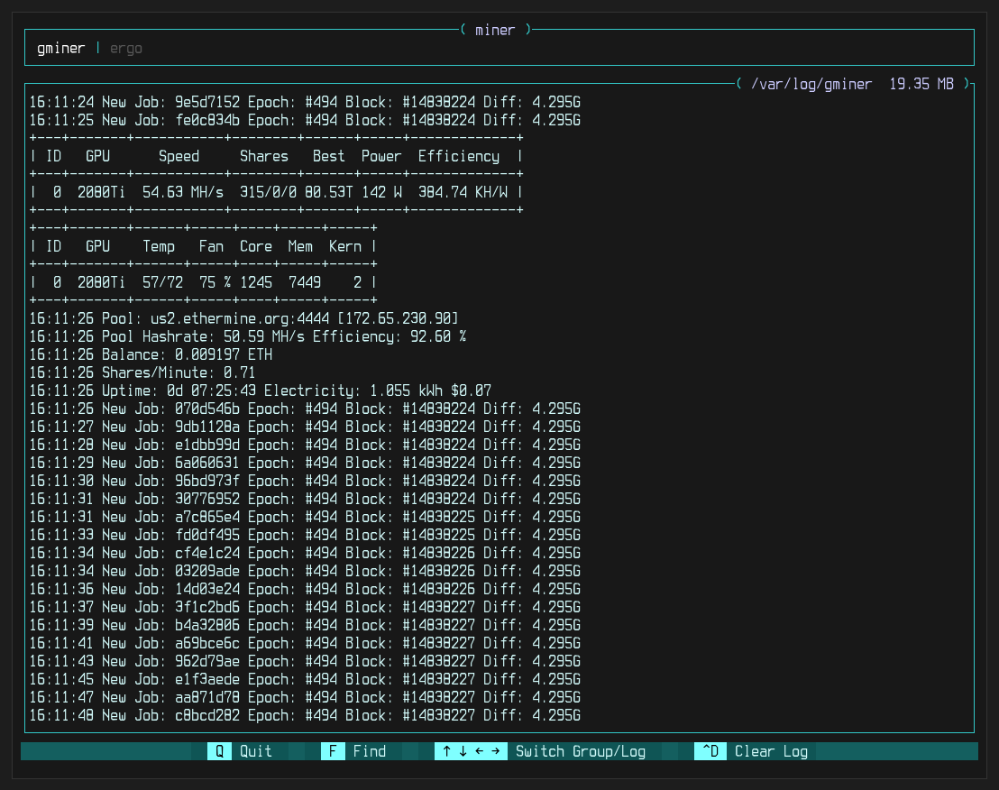

# logviewer
Simple app for viewing log files. (essentially it's just like `tail -f`)

logs can be sorted into `groups`  
each `group` can have multiple `logs`

```shell
git clone https://github.com/dbuchacher/logviewer
cd logviewer
# set env variable
# edit config file
cargo run
```
Watching a log update... how exciting


Handles Erros


Follow your OS rules to set an envirment variable (example of a set variable here)


Edit config file (example below)  
each line is a new `group`  
on each line a new `log` is seperated by a colon `:`


TODO:  
finish search  
finish clear log  
add windows path separator  
make this page better and more clear
